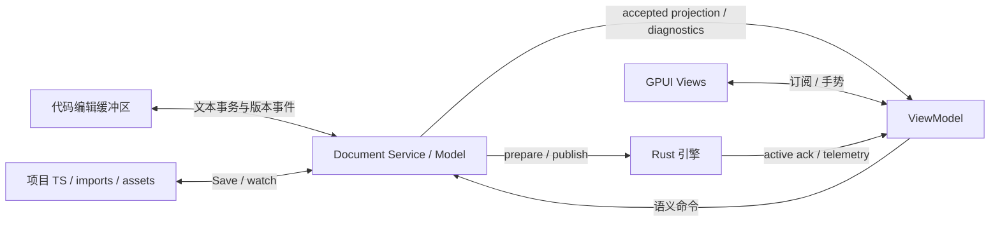

# MVVM 实时同步、模块回写与依赖结果本地化

状态：根据用户补充明确的目标契约。已实现单 Pattern 文档、所有权、import 与拆散候选
原语，见 [实施契约](../../docs/16-pattern-document.md)。完整工程文档、桥接、保存事务、
GPUI 音符/automation 编辑与拆散 review 已见 [18](../../docs/18-project-daw.md)，串联 rack
本地化见 [19](../../docs/19-plugin-configuration-source.md)。未覆盖的模块、typed 实例和
并行 rack/宏迁移仍按本设计推进；不能把设计示例当成全部已可调用的 API。

## 1. 一个 Model，两个编辑入口

打开 Oxitone 代码工程即创建 Document Session：入口、项目源码所有权、模块解析环境、
依赖锁与素材版本共同确定工程。GPUI 订阅该 session 的 ViewModel，无需手动导入/导出快照。

| 层 | 职责 |
| --- | --- |
| Model | Document Service 拥有源码文档/草稿、事务与 accepted Authoring Graph；已保存 TS 是持久事实来源 |
| ViewModel | 带版本的轨道、音符、生成规则、插件实例、编辑能力、诊断、待提交投影与命令 |
| View | GPUI Playlist/Piano/Mixer/插件面板和代码面板；绑定 ViewModel，提交语义命令 |
| 执行层 | Rust 接受候选并维护独立的 prepared/active graph、transport 和遥测 |

ViewModel 是 Model 的投影，不拥有另一份需要独立保存的音乐数据。GPUI Entity/通知机制
用于视图订阅；不能靠两个 mutable object 的属性观察器互相赋值建立保存语义。
每个值带 source revision；试听/effective 值与 authoring 初始值分开，音频遥测不触发源码写回。



代码变更后增量重建投影；图形手势提交后立刻更新同一源码草稿并推送代码面板。
结构候选异步验证，拖动中显示 pending 投影，accepted/active 独立确认。无需点击 Save
才能让另一视图看见变化；Save 仅将当前有效源码事务持久化。启用 autosave 也走同一事务。
代码语法暂时不合法时保留新文本和 last good graph，显示 Invalid draft，不能回填旧代码。

代码缓冲区同步必须分能力：

- 内置代码面板直接订阅文档 session，未保存文本也双向可见。
- 外部编辑器仅接文件 watch 时，只能看到已保存代码；GPUI 未保存草稿也不会自动出现
  在外部编辑器里。这个模式必须标为磁盘同步，不能宣传为未保存缓冲区实时绑定。
- 完整实时协作需提供外部编辑器文档桥接：open/change/close、buffer version、文本补丁、
  applied/rejected ack 和 Save 联动。桥接使用编辑器正常 text edit API，不能写磁盘来绕过
  dirty buffer，也不能依赖默认自动刷新覆盖用户输入。LSP 文本同步本身不等于完整事务实现。

为满足外部代码编辑的实时目标，文档桥接列入交付门槛；完整内置 IDE 仍非必需。
桥接未连接时保留磁盘同步能力与清晰状态，不能当作实时目标已经完成。

每次更新带 session、transaction、request 和 revision；应用文档通知不再发起语义编辑。
watch 回声只在路径、已发布 hash 和保存事务均匹配时去重。并发变更先检查缓冲区版本，
重基失败进入冲突；不能用“最后写入者胜出”覆盖代码或旧手势。重连以当前文档同步，
不会把旧 session 的 handles 重放到新实例。详细保存与崩溃语义沿用 03。

## 2. 回写所有权与 npm 边界

编辑 planner 先判定文件所有权，再选择 writer；发现不可写定义时回到项目内的调用/
引用边界。禁止把“定位到了依赖源码”误当作“可以编辑该源码”。

- 仅当前 session 明确纳入的项目源码可接受音乐回写。包解析可读取 npm 的导出与类型，
  无需包提供 sourcemap，也不要求包作者提供反向函数。
- `node_modules`、pnpm store、Yarn 缓存/归档、SDK 安装目录、生成产物与项目外模块是
  dependency/read-only。不通过补丁包、复制覆盖缓存、改锁定依赖内容来完成图形操作。
- 文件身份核对 logical path、realpath 与模块所属包。`node_modules` 下的符号链接、
  项目内指向依赖的链接不能绕过所有权；写入前重新核对父目录，禁止临时路径逃逸。
- monorepo 中用户显式纳入 session 的源码包可做定义编辑，按它的真实源码路径写；
  默认 workspace/link/file 依赖仍只读，不能因为它恰好在磁盘上就扩大写入范围。
- 插件管理器的显式安装/升级/卸载是独立依赖任务，可由包管理器变更安装目录。
  音符、参数、拆散、普通 Save 均不能借该任务篡改依赖内容。

有限、声明式的外部输出具有与本地输出相同的局部编辑能力：

```ts
import { makeChorus } from '@acme/arrangements';

const chorus = makeChorus({ key: 'C', bars: 8 });
const localChorus = chorus.edit([
  { select: { iteration: 2, note: { step: 3 } }, set: { pitch: 65 } },
]);
```

此示例要求返回 source 确实声明对应 selector。返回 literal 时使用音乐条件与 occurrence/
expect；返回 arrangement 时用 placement/note 的分层选择。不能假造第三方不存在的 step。
普通 JS、没有原 TS 的 npm 包也能在已知输出边界派生；优先保留包提供的生成行为。

## 3. 明确的拆散流程

当操作需要改变不暴露的内部结构、缺少可重放的局部 edit 表达，或用户显式选择
“拆散到项目”时，planner 生成 LocalizePlan。不能把任何编辑错误都自动转换成拆散：
SourceChanged、缺资源、选择歧义、插件缺失先按原错误处理。

LocalizePlan 至少包括：accepted source/dependency revisions、所选实例/轮次、最小可隔离
结果边界、音符/效果器数量、受影响引用、保留与冻结的生成规则、imports/exports/资产
变化、源码 diff、随机处理方式、候选校验结果和不能保持的能力。
只读构建候选可在用户确认前完成；确认后再发布音乐变更。取消保持全部原文。
确认绑定该具体计划及版本，发生外部变更要重算，不能拿旧确认覆盖扩大后的范围。

提示示例：

> 此操作需要拆散这个片段。它的 32 个音符将转换为项目内独立 Note，之后不再跟随
> makeChorus 的生成参数变化。其他 3 个引用保持共享。［查看代码变化］［拆散并编辑］［取消］

如果最小安全边界包含一个完整返回 Pattern，就说明“这一个 Pattern 的全部音符”；
如果可以隔离单轮就只展开该轮。不能用“只改一个音”的文案暗中展开整个段落或项目。
例外很多不是自动拆散条件；用户也可主动将当前结果固定为普通 Note 数据。

Note 本地化示例（展示已解析结果，不保存 `makeChorus(...).notes` 继续依赖动态生成）：

```ts
import { Pattern } from 'oxitone';

export const chorusLocal = new Pattern({
  lengthBeats: 2,
  notes: [
    { pitch: 60, start: 0, duration: 0.4, velocity: 0.8 },
    { pitch: 65, start: 0.5, duration: 0.4, velocity: 0.7 },
    { pitch: 67, start: 1, duration: 0.4, velocity: 0.8 },
    { pitch: 64, start: 1.5, duration: 0.4, velocity: 0.7 },
  ],
});
```

项目调用处引用本地变量/导出；后续拖动直接修改这些 literal，不继续堆 edit 包装。
新名字按音乐用途生成且避免当前作用域冲突，不使用 UUID。也不把外部包函数体复制为
所谓“独立 Note”；本地化的是声明式结果，不是 vendor 源码。

单纯 flat notes 不能自动保留原随机域：保留概率时必须用可读 seed/原生成坐标的显式
音乐字段或来源视图保留随机上下文，不得塞入 hidden ID。只有实现了对应 runtime 契约
且离线对拍通过，才能承诺声音不变。用户另选“固定本轮随机结果”时，可解析指定轮次的
事件并冻结概率，提示未来随机变化消失。当前 v1 scheduler 不满足前一种本地化门槛。
窗口的原 offset、iteration、长音延续同样不可在拆散中丢失；无法等价应在计划中说明，
不把编辑带来的有意差异与无关事件的声音漂移混为一谈。

无界生成器必须先明确有限片段范围；未知外部 I/O 或直接修改 Project 的副作用函数，
不能仅凭最终 snapshot 安全删除原调用。须先有可隔离声明式返回/capture 边界，否则
报告不可表示；提示“拆散”不能代替缺失的来源和副作用证明。

## 4. import/export 是语义事务的一部分

模块 planner 使用 TypeScript Program 的符号与实际 runtime resolver 共同判定引用。
跟踪 alias、default/named import、namespace import、re-export/barrel、type-only import、
导出绑定与可写引用位置；类型解析与执行解析不一致时报错，不能改到另一个条件导出。

| 情况 | 回写规则 |
| --- | --- |
| 项目内直接变量/调用 | 在选中引用处派生；只有选择定义范围才改共享定义 |
| `import { phrase as p }` | 实例编辑写 `p.edit(...)` 或本地替代引用，不赋值 imported binding |
| `import * as parts` | 在使用处派生 `parts.phrase`，不写 namespace 属性 |
| 项目内 default/named export | 保留导出名称/默认形式；定义修改列出所有受影响消费者 |
| `export { phrase } from 'pkg'` | 实例修改落在消费者；项目导出整体本地化则改项目 re-export 为本地同名导出 |
| `export * from 'pkg'` | 原 star export 保留；只对已唯一解析且明确选中的名称加本地显式导出；歧义时拒绝 |
| async factory / dynamic import | 在已解析的返回/await 结果引用边界操作，不复制调用或改变 await 次序 |
| CJS/自定义 loader/计算型导出 | 按 adapter 能力提供项目边界编辑；无法证明模块语义则拒绝模块重写，不改依赖 |

引入 Pattern/plugin 等值时先复用可见且未被遮蔽的运行时 import。`import type` 不算
运行时绑定；需要值则新增合适 value import，保留其他 type imports。检查嵌套作用域、
已有局部名、命名/默认导出和 imported alias，禁止仅按字符串替换。无须新增 imports 的
`.edit` 不主动整理整个文件。

新本地文件例如 `arrangements/chorus.ts`、`effects/lead-rack.ts` 是普通项目模块。
新 import 路径遵循工程已有 TS/ESM 扩展名策略、tsconfig、package imports/exports 和
实际运行 resolver；不能直接把磁盘 `.ts` 路径当成所有项目都合法的运行 import。
新模块只引用必要的公共插件导出/资产，避免反向引用入口造成循环；无法避免就放回调用
所在模块。不能通过新增 re-export 改变函数初始化时序或 TS live binding 语义。

拆散后若还有其他调用，保留原 npm import。无引用不等于无副作用：删除最后一个 value
specifier 时，只有证明模块无相关副作用才删除整条 import；否则保留 side-effect import，
并准确显示该包仍是工程依赖。未知副作用的工厂调用也不能以保留模块 import 代替原调用。
不在普通 Save 中顺手卸载包或改 package exports；真正移除依赖走管理器的独立任务。

移出函数/模块的数据不能保留失效 closure 引用。可表示为项目内 literals、正常导入或
显式资产引用才本地化；资源 URI 保持原始解析结果，必要时复制为内容寻址资产并重写基准。
插件需要的内部资源不可通过未公开的 npm 深层路径强行导入；使用稳定公开导出，或导入
项目资产。资产不可读/缺失时不提交一个看似独立但无法重开的配置。

所有源文件、导入导出、绑定和资产变更在同一 save journal 内验证/保存/Undo。
首次拆散提示批准整个可审查差异；后续普通 Note/参数编辑不重复提示。

## 5. 效果器组合按相同原则本地化

npm rack/chain 工厂若返回可追踪组合，先在项目调用处做配置/实例派生。拆散时创建项目内
独立插件 Config/Instance 与显式有序链/路由，保留准确插件版本、参数/default、host mix/
bypass、资源、structured/opaque configuration、automation 与 sidechain/send 关系。

普通 serial chain 可以是独立声明式实例列表；并行 rack 必须保留总线与混合拓扑，不能
为了“拆成数组”改成串联。宏旋钮若有可表示的映射，转成项目内显式绑定；否则提示固定
当前宏的配置结果、丢失联动。隐藏的动态映射无法重建时不承诺等价拆散。
绑定按实例对象重建，不按 insert index 猜配；其他使用同一 rack 工厂的实例保持原样。

示例提示：“将此组合转为项目内 3 个独立效果器，保留顺序与自动化；不再跟随组合预设
更新。”实际若有并行路由/宏冻结必须一并展示。拆散结束后继续可在普通插件面板编辑。

本地化组合配置不会替代插件 DSP。npm 中一个黑盒 DSP 插件仍需该插件二进制；除非它
公开可导出的子图，否则无法拆成内置效果器。opaque state 可作为显式配置资产保存，
不能伪造成可逐字段编辑对象；运行 delay buffer/voice 状态不属于 Save 内容。
管理器区分“组合生成依赖”和“仍需的运行插件/素材依赖”，不能把本地化标成无需外部插件。

## 6. 新增验收门槛

- GPUI 打开代码工程后自动订阅；未保存图形/内置代码编辑双向更新，同一手势一条 Undo。
- 外部桥接 dirty buffer 双向补丁与版本冲突；断连明确降级，watch 模式只承诺磁盘同步。
- 自身通知不回环；旧候选/旧 ack/重连旧请求不误写，保存不丢 pending 编辑。
- 真实 npm fixture 无 TS/sourcemap 仍可编辑声明式输出；选中引用本地派生，包内容 hash 不变。
- materialize 的 diff/确认/取消/过期计划、有限展开范围、缓存删除后重开与离线等价检查。
- imports 的 alias/namespace/default/type-only/shadowing、barrel/star export、循环、动态
  import、side-effect module、pnpm symlink 与项目外依赖均覆盖；写入集不得落入依赖源码。
- 效果器组合拆散覆盖串联/并联、宏、同名参数、资源/state、实例重排与 automation 重绑定。
- helper-only 依赖可被移除时，本地结果独立重开；仍需 DSP/资源依赖时正确保留和报告。

P2 实现模块 planner、本地化事务及代码缓冲区桥接；P3 验证来源/随机/ABI 配置等价；
P4 接入 MVVM 与拆散提示/管理器；P5 验收实时编辑、跨进程恢复及全部依赖边界。
