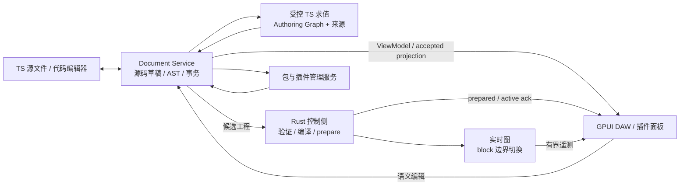

# Oxitone 代码 / DAW 双向创作架构

状态：完整目标设计，2026-09-08，首批 Pattern/source writer 已实现，完整 DAW 尚未完成。
实际能力见 [实施契约](../../docs/15-source-authoring.md)。本文组整合并取代同日三个探索草案的设计建议；
旧草案里的源码盘点仍是实施前基线。用户已明确项目尚未发布，允许重设全部相关定义。
因此目标不承担旧 authoring API、snapshot、插件 ABI 或只读 Preview 的兼容包袱。
实现时整体迁移 SDK、Rust、GPUI、示例与 fixtures，不长期维持两套编辑体系。

## 1. 产品定义

Oxitone 提供同一个工程的 TypeScript 与 GPUI 两种创作入口。用户可以写函数生成音乐，
也可以在 DAW 中编辑音符、编排、采样、automation、Mixer 和插件；保存结果是正常 TS 源码。
GPUI 是代码工程的结构化编辑器，同时是 Rust 音频引擎的交互宿主。

“双向”指代码与图形操作汇入同一文档事务，两个入口观察同一 authoring 结果。
它不要求任意 JS 程序都存在唯一逆函数，也不把运行中的 DSP 内存视为可直接修改的工程数据。

不可让步的约束：

- 不要求用户手写实体/音符/插件实例 ID，不在 TS 插入隐藏 UUID、绑定注释或装饰器。
- 音乐配置、生成规则、局部例外、插件注册与依赖入口存在于正常 TS/imports；素材与插件
  二进制是显式外部资产。编辑器缓存丢失不改变已保存音乐。
- 保留函数与共享抽象；单个输出编辑默认产生局部变体，只有明确的规则编辑才向上游传播。
- TS 掌管 authoring；Rust 掌管调度、解码、DSP、设备与导出，音频回调不执行 JS。
- 图形操作不能静默改动未选中的事件、插件实例或随机结果；无法保证时拒绝提交并保留草稿。
- 外部插件和 GPUI 插件管理器是首个完整 DAW 版本的必需范围。
- 采用 MVVM 文档订阅实现代码/GPUI 实时同步；未保存外部缓冲区通过文档桥接参与。
- 音乐回写只修改当前项目；外部生成结果需要拆散时提示范围并本地化，不篡改 node_modules。

## 2. 确定采用的架构

只有 Document Service 拥有可变源码文档。GPUI 的拖动投影、执行后的 Authoring Graph、
Rust RenderGraph 都是带版本的派生状态，不是三个独立的持久化事实来源。
Authoring Graph 保留生成语义；RenderGraph 保留高效执行所需的编译结果；两者不混为一图。

| 决策       | 采用方式                                                                         |
| ---------- | -------------------------------------------------------------------------------- |
| 生成器表示 | chord/arp/集合组合/loop/automation 保留显式表达式节点与输出来源                  |
| 局部例外   | 使用普通 TS 的 `.edit(...)`、配置派生与时间区间覆盖表达式                        |
| 通用 TS    | 继续执行普通函数；在可追踪输出边界包装编辑，不静态求解任意函数体                 |
| 源码修改   | AST/符号分析定位，文本区间补丁保留注释和风格；不用 snapshot 重印整个项目         |
| 实例身份   | 会话 handle + source revision；wire ID 自动生成；与随机种子分离                  |
| 随机性     | 音乐 seed + 稳定的生成坐标；不依赖 AST 路径、wire ID、创建顺序                   |
| 参数地址   | owner 与 target kind、原样 parameterId 分字段；插件实例成为图中一等节点          |
| 自动化     | 保留函数结构，增加原生区间覆盖、独立时钟映射与显式 lane 优先级                   |
| 插件 ABI   | 统一采用新 ABI 2，支持参数、资源、配置 state、能力与独立 UI 协议                 |
| 工程文件   | TS 源码 + package/插件依赖锁 + 内容寻址资产；缓存和恢复日志不承载唯一音乐语义    |
| 版本       | 目标 wire protocol 2.0、authoring document format 1、plugin ABI 2、UI protocol 2 |

版本号标识新设计，不表示已有实现。没有为旧 ABI 1 保留长期运行分支的要求。
旧示例/工程的迁移是一次工程重构；不可自动迁移的任意函数输出提供可审查的 TS 转换。

## 3. 完整规格导航

| 文档                                                       | 决定的问题                                                   |
| ---------------------------------------------------------- | ------------------------------------------------------------ |
| [01-authoring.md](01-authoring.md)                         | 公共 API、表达式图、生成器与实例局部编辑、所有现有高阶能力   |
| [02-source-writing.md](02-source-writing.md)               | AST/来源追踪、无显式 ID、代码写回、普通 TS、重开与代码质量   |
| [03-document-session.md](03-document-session.md)           | 草稿/播放/保存状态、IPC、Undo、外部修改、GPUI 交互与保存事务 |
| [04-runtime.md](04-runtime.md)                             | 随机性、时钟与循环、automation、增量换图、实时约束           |
| [05-plugins.md](05-plugins.md)                             | ABI 2、插件配置与 UI、注册/发现/依赖、完整 GPUI 插件管理器   |
| [06-delivery.md](06-delivery.md)                           | 包/crate 归属、协议迁移、分阶段实施、验收矩阵与性能门槛      |
| [07-mvvm-and-localization.md](07-mvvm-and-localization.md) | MVVM 实时同步、import/export、npm 边界与音符/效果器组合拆散  |

## 4. 两类必须诚实保留的边界

完全相同的两个输出在外部任意重构后，不总能判断哪一个是旧实例；没有持久标记就不承诺
跨任意重构恢复选择。持久音乐修改已成为当前 TS 语义，不需要重放旧编辑 handle。
只有未提交事务需要重定位；不唯一就冲突，不猜测后覆盖代码。

运行外部 TS/native 代码可能有 I/O、非确定性或副作用。进程超时与故障隔离不等于安全沙箱。
可视化编辑对受控 declarative 输出有确定规则；对未知副作用范围要求显式生成边界，
不能以“解析了所有 AST”为由承诺任意程序的语义等价重构。

上述是信息与执行模型的边界，不是沿用旧 SDK 的限制。旧的参数命名冲突、随机 seed 路径、
ABI 不支持资源/state、只能只读等问题都在本目标中正面重设计。
