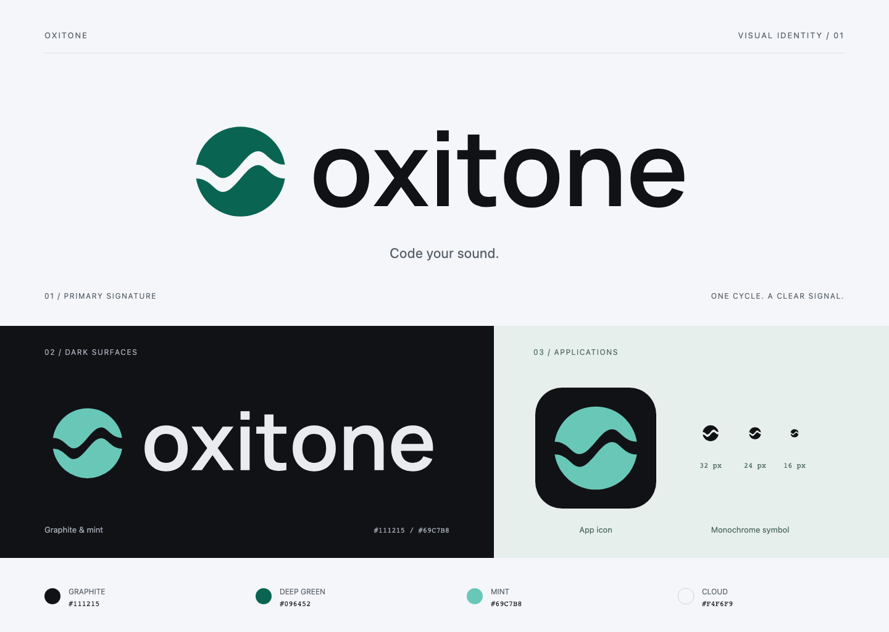

# Oxitone visual identity

## Concept

**一个周期，一枚 O。** 圆形轮廓取自 Oxitone 的首字母；贯穿圆形的波形留白
呈现一个经过几何化处理的振荡周期。上下两个形体旋转对称，呼应声音的周期与相位。
厚实的轮廓和开放的留白让它在工具栏、包图标和应用图标中保持辨识度。

配色沿用应用现有的石墨黑、深绿与薄荷绿。小写字标保持亲和、克制的工具气质，
与项目现有的 “Code your sound.” 定位一致。标志使用纯色，透明部分是真正的留白。

## Files

| File                                                        | Use                                                                |
| ----------------------------------------------------------- | ------------------------------------------------------------------ |
| [oxitone-logo-light.svg](oxitone-logo-light.svg)            | Primary horizontal logo on white or light backgrounds              |
| [oxitone-logo-dark.svg](oxitone-logo-dark.svg)              | Mint symbol and light wordmark on dark backgrounds                 |
| [oxitone-logo-mono.svg](oxitone-logo-mono.svg)              | Single-color horizontal logo; inline SVG inherits `currentColor`   |
| [oxitone-mark.svg](oxitone-mark.svg)                        | Standalone single-color symbol; inline SVG inherits `currentColor` |
| [oxitone-app-icon.svg](oxitone-app-icon.svg)                | Square icon artwork with transparent outer padding                 |
| [oxitone-app-icon.png](oxitone-app-icon.png)                | 1024 × 1024 transparent PNG export of the app icon                 |
| [overview.svg](overview.svg) / [overview.png](overview.png) | Design presentation, including dark and small-size examples        |

The five production SVGs contain vector paths, with no external fonts, images,
scripts, masks or filters. The wordmark is outlined; it renders consistently without
installing a font. The overview uses system fonts for explanatory labels only.

The app icon is artwork for packaging; adding it to the native app bundle or
generating platform icon containers is separate from this asset delivery.

## Color

| Color      | Hex       | Role                                                 |
| ---------- | --------- | ---------------------------------------------------- |
| Graphite   | `#111215` | Primary wordmark, monochrome symbol, icon background |
| Deep green | `#096452` | Symbol on light backgrounds                          |
| Mint       | `#69C7B8` | Symbol on dark backgrounds                           |
| Cloud      | `#F4F6F9` | Light presentation background                        |
| Light text | `#E9EBEF` | Wordmark on dark backgrounds                         |

These colors match `apps/preview/src/theme.rs`. Use deep green on light surfaces
and mint on graphite. For print or one-color use, render the complete logo in a
single dark ink or reversed white.

## Sizing and spacing

- Symbol artboard: `256 × 256`; nominal circular silhouette: `208 × 208`.
- The upper shape and its 180° rotation form the mark. Preserve the wave opening.
- Leave at least 32 artboard units of clear space outside the symbol silhouette;
  allow an equivalent quarter-symbol width around the horizontal logo.
- Minimum standalone SVG size: **16 × 16 CSS px**; **24 px or larger** is preferred.
- Minimum horizontal logo width: **180 CSS px**. Use only the symbol below this.
- The app icon includes its own inset and rounded background. For small favicons,
  use the standalone symbol to preserve the wave opening.
- Scale proportionally. Keep the symbol and lettering together at the supplied
  spacing; do not stretch, rotate, outline, add shadows or close the wave opening.
- `currentColor` inherits from the parent only when the SVG is inline. An SVG used
  through `` is a separate document; use the supplied light/dark variants or
  explicitly set its fill before exporting.

## Typography and license

The wordmark uses **Manrope**, weight **650**, with slightly tightened letter
spacing (−15 units on a 2000-unit em).
Glyphs are stored as paths, not editable text. Source: the
[Google Fonts Manrope directory](https://github.com/google/fonts/tree/main/ofl/manrope).
The original font license is included in [OFL-Manrope.txt](OFL-Manrope.txt).
Manrope is by The Manrope Project Authors and is licensed under SIL OFL 1.1.

The logo and icon artwork are covered by the repository license. The included OFL
documents the font source; this directory does not distribute font binaries.

## Review

The supplied art was rendered in Chromium for light/dark and monochrome review,
including the standalone symbol at 16, 20, 24, 32, 48, 64, 128 and 256 px. The
horizontal logo was checked at 180 and 360 px. The PNGs are design exports, not
screenshots of the native application.
